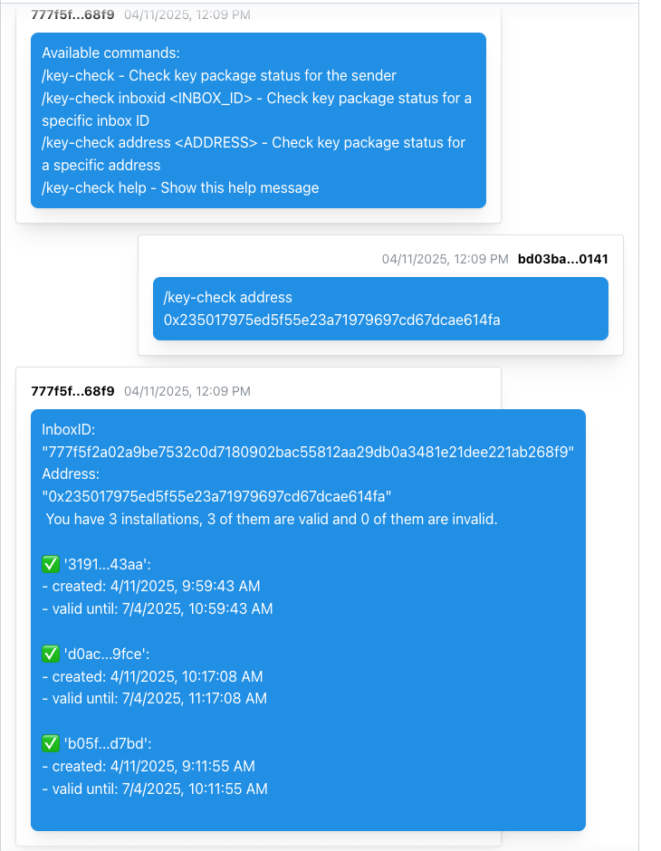

# Key Check Agent

This agent helps you check the status of XMTP key packages for yourself or other addresses.



## Getting started

> [!TIP]
> See XMTP's [cursor rules](/.cursor/README.md) for vibe coding agents and best practices.

### Requirements

- Node.js v20 or higher
- Yarn v4 or higher
- Docker (optional, for local network)

### Environment variables

To run your XMTP agent, you must create a `.env` file with the following variables:

```bash
WALLET_KEY= # the private key of the wallet
ENCRYPTION_KEY= # encryption key for the local database
XMTP_ENV=dev # local, dev, production
```

### Run the agent

```bash
# install packages
yarn
# run the bot
yarn dev
```

## Using the Key Check Agent

Once the agent is running, you can interact with it using the following commands:

- `/key-check` - Check key package status for the sender
- `/key-check inboxid <INBOX_ID>` - Check key package status for a specific inbox ID
- `/key-check address <ADDRESS>` - Check key package status for a specific address
- `/key-check groupid` - Show the current conversation ID
- `/key-check members` - List all members' inbox IDs in the current conversation
- `/key-check version` - Show XMTP SDK version information
- `/key-check help` - Show the help message with available commands

Note: You can use `/kc` as a shorthand for all commands (e.g., `/kc help`)

The agent will respond with information about the key packages, including:
- Total number of installations
- Number of valid and invalid installations
- Creation and expiry dates for valid installations
- Error messages for invalid installations